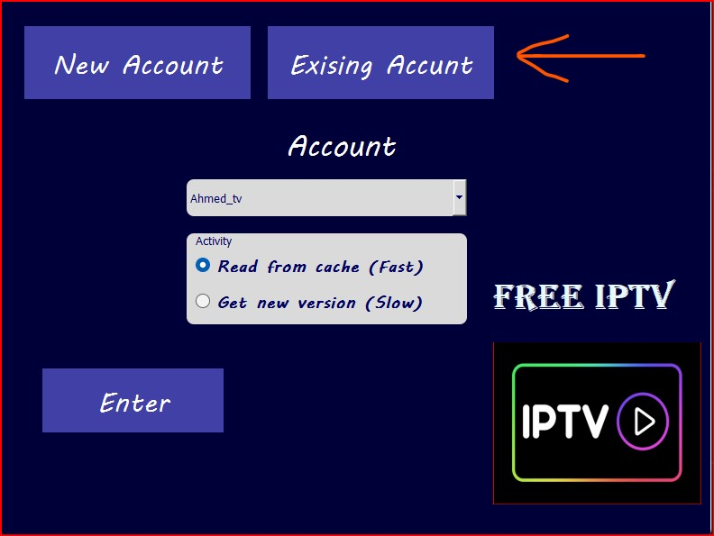
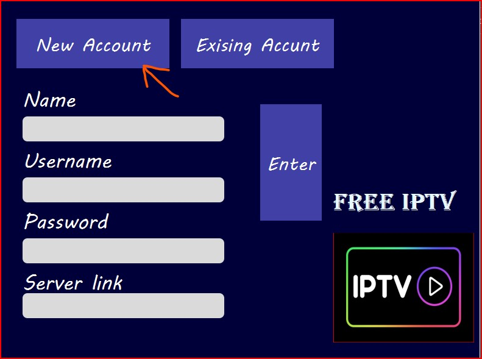
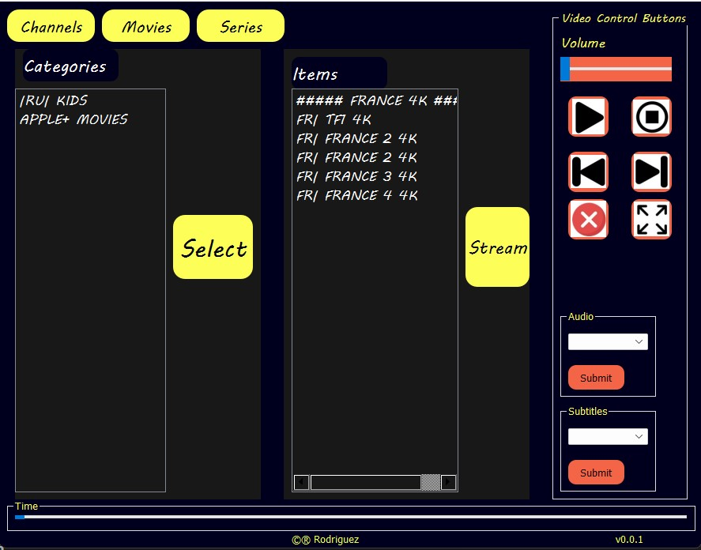
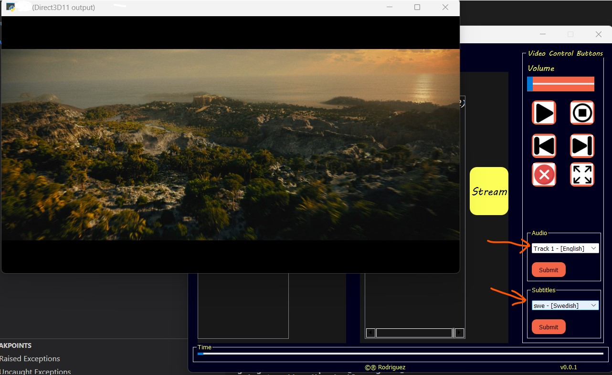
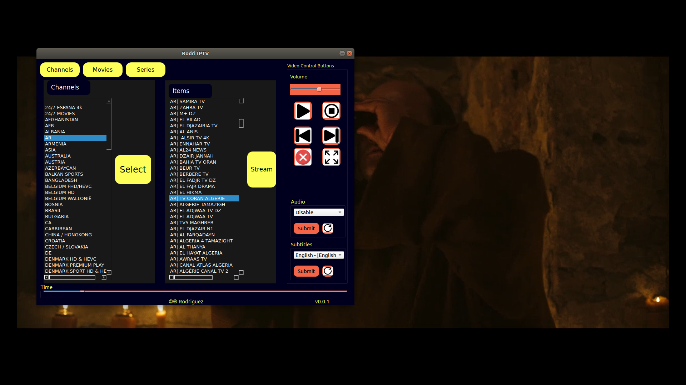
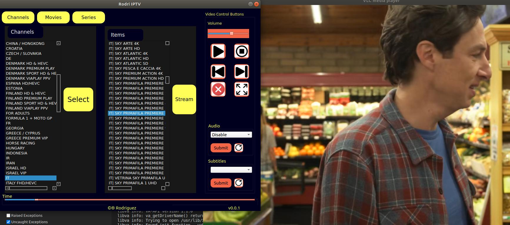

# iptv_player
Browse &amp; stream your IPTV channels, movies and series easily. Pick up any item and enjoy watching!
# What has been done untill now...

#### Login menu, where user login from already existing accounts. Give also a chance to user to either read from cache copy, which is much faster, or make new request to the server to update the existing file, which is slow and will take time to lunch the app. 

#### Login menu, where user input new account. A new account will be created, stored to be rememberd next time user uses the app, and also request the data from the server to store it as a local cache copy.

#### When the user login, and everything goes successfully, the user get this frame. The user have ability to choose live channels, movies or series to stream. A video control is also provided where user can control, choose audio-track or subtitles

#### An example where a movie is playing and the user choose a subtitle to.

## Ex 

## Ex 

